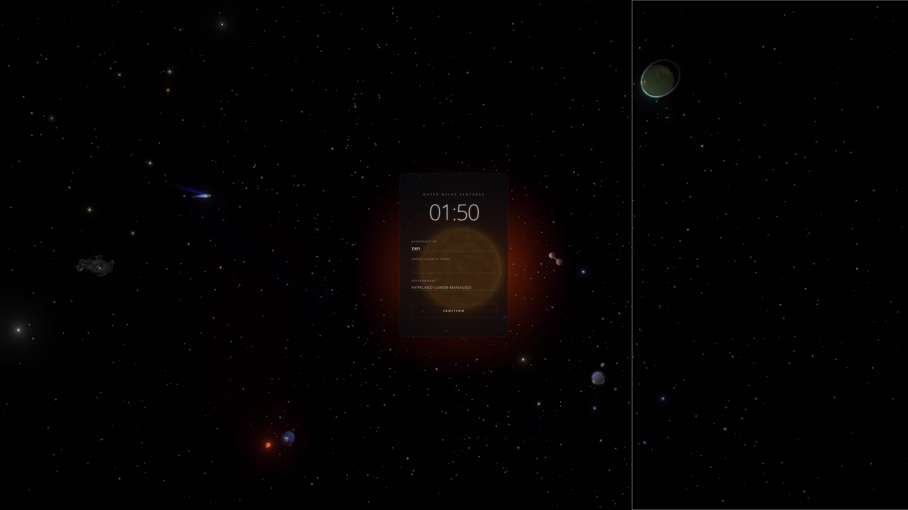

<div align="center">

# 🪐 Outer Wilds SDDM

**Outer Wilds inspired SDDM theme for Linux.**<br>




</div>

---

## 📦 Installation

Ensure you have the required dependencies installed (`qt5-graphicaleffects` and `qt5-multimedia`).

1. **Clone the repository:**
   
```bash
git clone https://github.com/lorediggia/Outer-Wilds-SDDM-theme.git
```

2.  **Move it to the SDDM themes directory:**

```bash
cd Outer-Wilds-SDDM-theme
sudo cp -r outer-wilds /usr/share/sddm/themes/
```

3.  **Apply the theme:**

Edit your `/etc/sddm.conf` (or `/etc/sddm.conf.d/default.conf`) and set:

```ini
[Theme]
Current=outer-wilds
```

## 🎬 Credits

- **Background Video:** Created by [Fando Man](https://www.youtube.com/watch?v=sXjrO1CihuI).
- **Inspiration:** *Outer Wilds* by Mobius Digital & Annapurna Interactive. 


